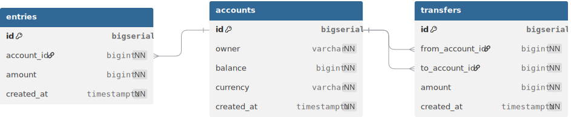

# go-bankify
A simple backend service for banking applications built with golang. It will provide APIs for the frontend to do following things:

1. Create and manage bank accounts, which are composed of owner’s name, balance, and currency.
2. Record all balance changes to each of the account. So every time some money is added to or subtracted from the account, an account entry record will be created.
3. Perform a money transfer between 2 accounts. This should happen within a transaction, so that either both accounts’ balance are updated successfully or none of them are.

## Database Schema




## Setup local development

### Install tools

- [Docker desktop](https://www.docker.com/products/docker-desktop)
- [TablePlus](https://tableplus.com/)
- [Golang](https://golang.org/)
- [Homebrew](https://brew.sh/)(For MacOS/Linux)
- [Migrate](https://github.com/golang-migrate/migrate/tree/master/cmd/migrate)

    ```bash
    brew install golang-migrate
    ```

<!-- - [DB Docs](https://dbdocs.io/docs)

    ```bash
    npm install -g dbdocs
    dbdocs login
    ``` -->

<!-- - [DBML CLI](https://www.dbml.org/cli/#installation)

    ```bash
    npm install -g @dbml/cli
    dbml2sql --version
    ``` -->

- [Sqlc](https://github.com/kyleconroy/sqlc#installation)

    ```bash
    brew install sqlc
    ```

<!-- - [Gomock](https://github.com/golang/mock)

    ``` bash
    go install github.com/golang/mock/mockgen@v1.6.0
    ``` -->

### Setup infrastructure
<!-- 
- Create the bank-network

    ``` bash
    make network
    ``` -->

- Create and Start postgres container:

    ```bash
    make postgres
    ```

- Create go-bankify database:

    ```bash
    make createdb
    ```

- Run db migration up all versions:

    ```bash
    make migrateup
    ```

<!-- - Run db migration up 1 version:

    ```bash
    make migrateup1
    ``` -->

- Run db migration down all versions:

    ```bash
    make migratedown
    ```

<!-- - Run db migration down 1 version:

    ```bash
    make migratedown1
    ``` -->

<!-- ### Documentation

- Generate DB documentation:

    ```bash
    make db_docs
    ```


### How to generate code

- Generate schema SQL file with DBML:

    ```bash
    make db_schema
    ```

- Generate SQL CRUD with sqlc:

    ```bash
    make sqlc
    ```

<!-- - Generate DB mock with gomock:

    ```bash
    make mock
    ``` -->

<!-- - Create a new db migration:

    ```bash
    make new_migration name=<migration_name>
    ``` -->

### How to run

- Run server:

    ```bash
    make server
    ```

- Run test:

    ```bash
    make test
    ```

## API Endpoints

The following REST API endpoints are currently available:

### Account Management
| Method | Endpoint | Description |
|--------|----------|-------------|
| `POST` | `/api/v1/accounts` | Create a new bank account |
| `GET` | `/api/v1/accounts/:id` | Get account details by ID |
| `GET` | `/api/v1/accounts` | List all accounts |
| `PUT` | `/api/v1/accounts/:id` | Update account information |

### Transfer Management
| Method | Endpoint | Description |
|--------|----------|-------------|
| `GET` | `/api/v1/transfers` | List all transfers |
| `POST` | `/api/v1/transfers` | Create a new money transfer between accounts |


### Todos
- create a bank network
- support for 1 migration up/down 
- implement db mock with gomock
- provide support for db docs

